# 起

如你所见，我上一个电脑，似了，也就用了一节课的时间，省流：诊断为南桥损坏。

没办法，没电脑用那几天在干什么呢，可以单开一篇讲一讲，保留保留吧。

然后我便拜托一靠谱哥们帮我捡捡垃圾，垃圾没捡到，阴差阳错捡了台 Intel 的 MacBook Pro，也是神奇，不过还怪好用的，但是这电池是真没有 M 系列的耐造吧，不过人家都 2019 年的老东西了，让让吧。

整体体验还行，希望这台 mbp 可以帮我渡过这段相对困难的时期 ^_^

# 开始折腾

## 关于硬件层面

这次捡到的是一台 9 代 i7 处理器，搭载 Radeon Pro 555X 4GB 独立显卡，32 + 256 的 19 款 15 寸 MacBook Pro，虽然整体配置抽象了点，但是 2650 的价格又使人购买欲大大提高，毕竟储存不够的问题可以通过外挂硬盘来解决。

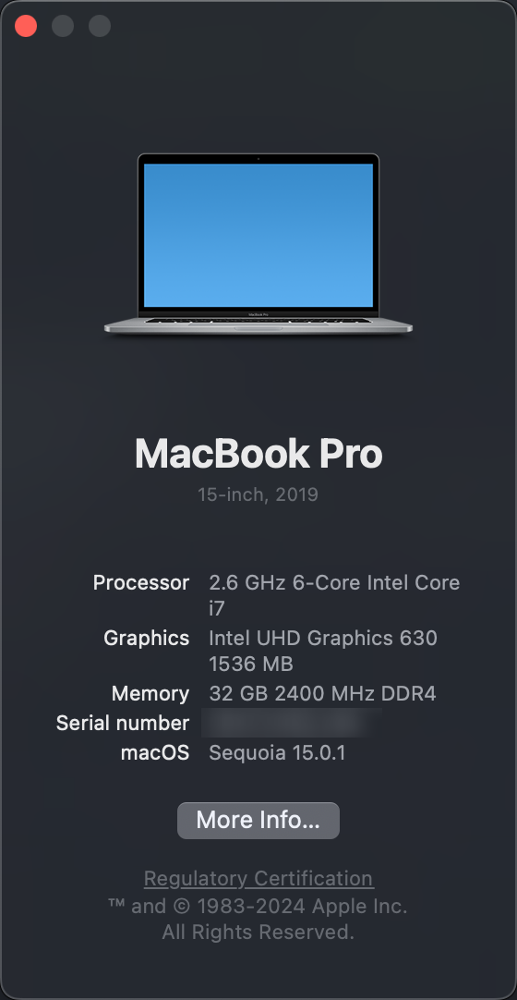

轻便倒是挺轻便的，就是太烫了，冬天里的暖手宝，热能释放丝毫不亚于小米。

同时还有一个比较吸引我的是 Touch Bar。这个名副其实的「美丽废物」在后续版本的 MacBook 中已经被移除了，不过这次碰巧能把玩一下上个时代的产物，倒也不错。

其余更多的参数似乎没有展示的必要，毕竟折腾上来说，还是软件层面更加吸引人 :)

## 搭建一个舒适的 Lite Workstation

想起之前重达 9 斤的电脑，之前还背着这家伙全国到处飞，这次的 mbp 则让轻便出行成为了可能。

这次参考了一些资料，其中印象深刻的是[国光](https://www.sqlsec.com/2022/01/monterey.html)大佬的配置方法，非常好用！


### 三指拖移

神中神之触控板，这或许也是果子的设计哲学之一。即刻开启「三指拖移」

System Settings -> Accessibility -> Trackpad Options -> Dragging style -> Three Finger Drag

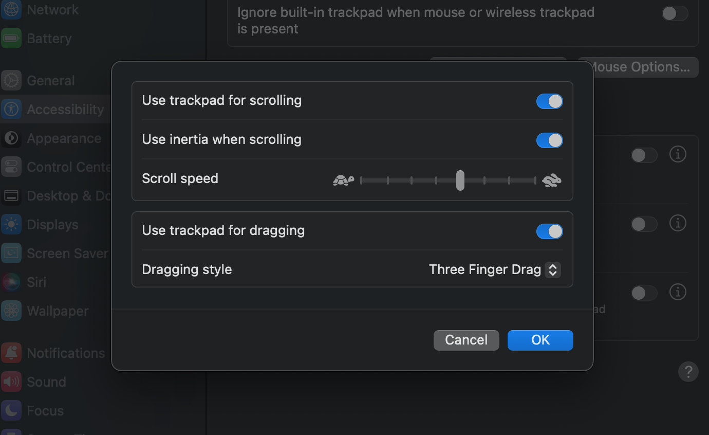


### 关闭 SIP

:::caution
关闭 SIP 虽然对大大简化安装软件的过程，但是其对系统安全性带来的影响不容忽视。
:::

重启，按住「Option」键，进入启动选项后按下 「Command」+「R」，进入恢复模式。

Utilities -> Terminal

输入如下命令以关闭 SIP

```bash
csrutil disable
```

### Local Network

天杀的 macOS，不开这东西局域网内访问直接不通。

System Settings -> Privacy & Security -> Local Network

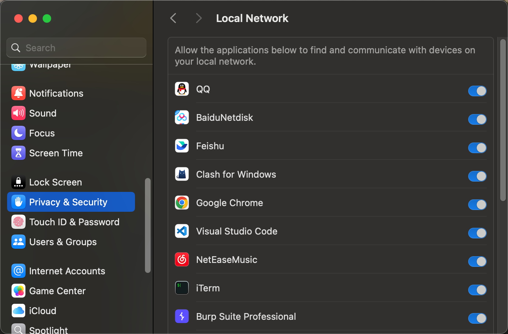


### Homebrew

久仰 macOS 大名，上手体验后，只能说相较于 Windows，喜欢 Linux 的有福了。

macOS 不能没有 [Homebrew](https://brew.sh/)，就像 Ubuntu 不能没有 apt。

使用以下命令安装 Homebrew，至于为什么慢……懂得都懂。

```bash
/bin/bash -c "$(curl -fsSL https://raw.githubusercontent.com/Homebrew/install/HEAD/install.sh)"
```

要啥直接装，反正就是好用，不接受任何反驳

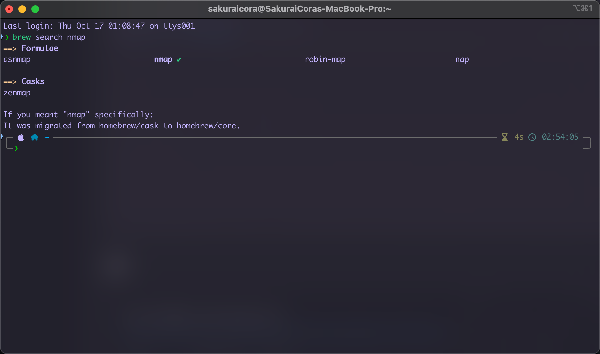


### 超级右键

使用 App Store 下载即可，macOS 单调的右键菜单可不好受。
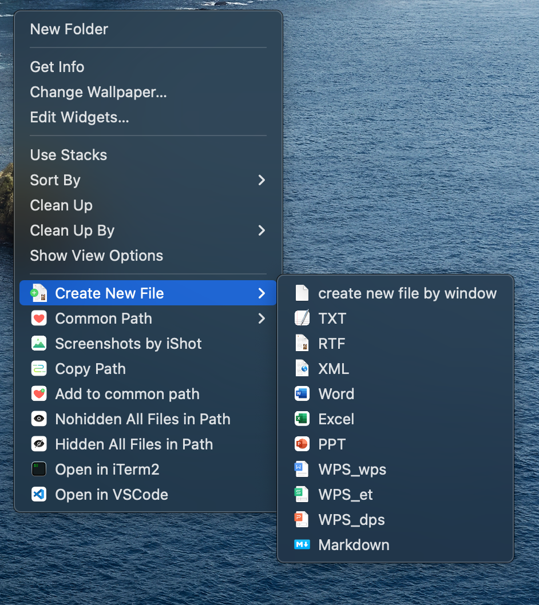

### OrbStack

喜欢 Docker 和虚拟机的有福了，对于一些轻量级的使用完全足够了。

前往 [OrbStack官网](https://orbstack.dev/download) 下载，或者使用 Homebrew 安装

```bash
brew install orbstack
```

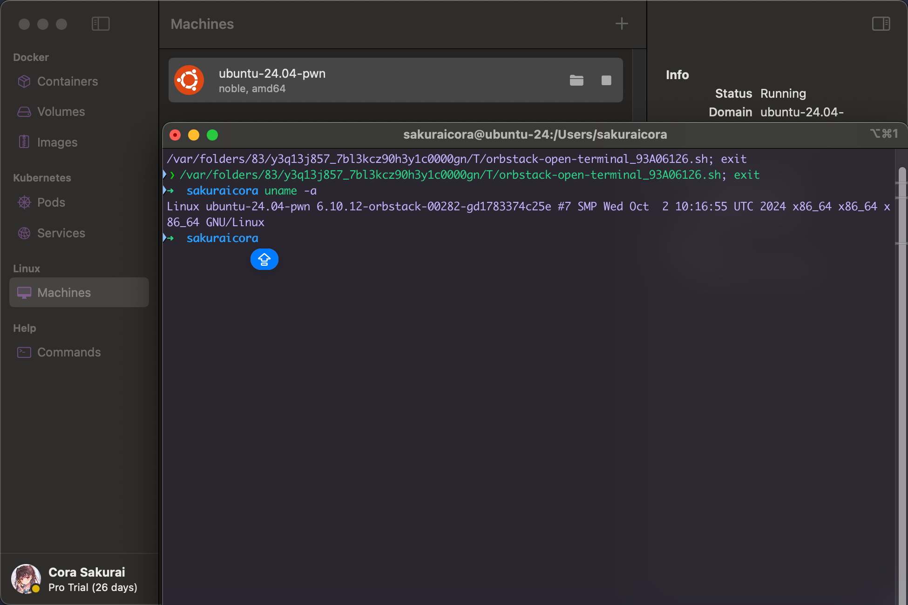

#### Maccy

实用的剪切板历史管理工具，适合用惯了 「Windows」 + 「v」 组合键的用户。

前往 repo -> [p0deje/Maccy](https://github.com/p0deje/Maccy)

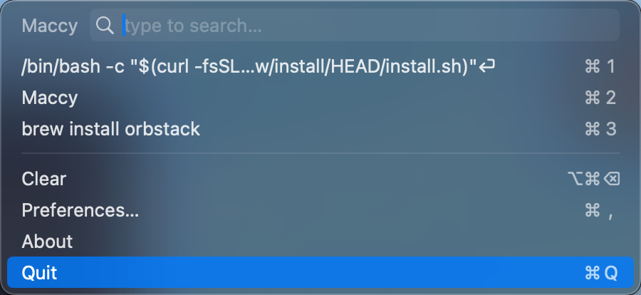

### Mos

或许也是果子的设计哲学之一，但是「Natural scrolling」我是真的不会使用，触控板和鼠标滚轮的使用逻辑是相反的，很难让人接受，可以使用 Mos 这一款小工具来帮你自动切换滚动模式。

前往 repo -> [nathan-lab/mos](https://github.com/Caldis/Mos)

或者使用 Homebrew 安装

```bash
brew install mos
```

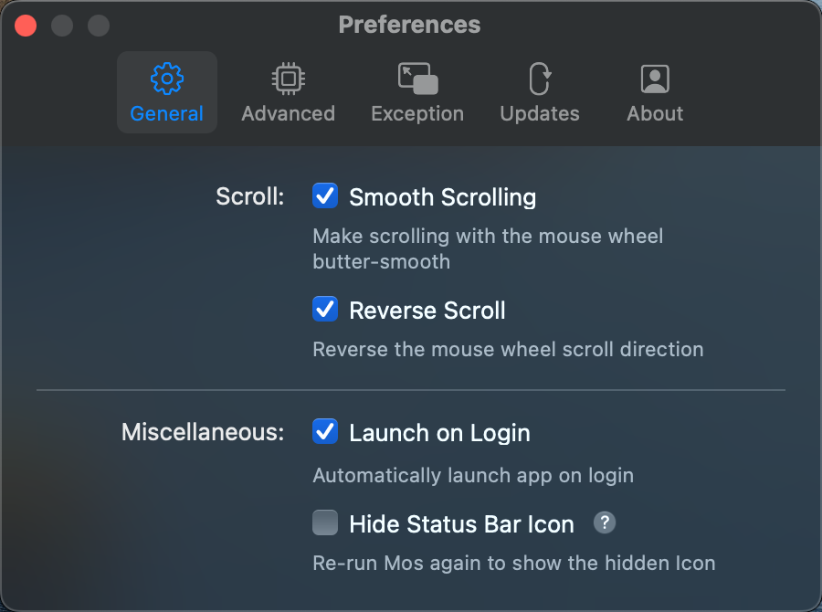

### Keka

macOS 中的 「7-zip」，比自带的压缩包管理工具好用许多，但是 App Store 中需要收费，可以前往官网下载。

下载链接：[https://d.keka.io/](https://d.keka.io/)

虽然界面没有 Windows 那样的直观，但是使用体验还算不错。

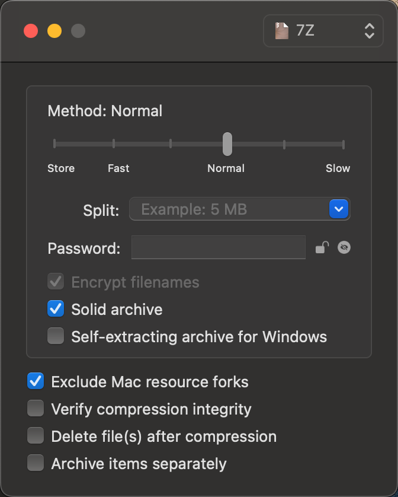

### IINA

macOS 的视频支持不太友好，然后我选择了 IINA 这个开源软件，它的界面很直观，使用体验还算不错。

前往 repo -> [iina/iina](https://github.com/iina/iina)


### Loopback

在使用 OBS 进行录屏的时候，发现声音不能内录，遂采用虚拟声卡。

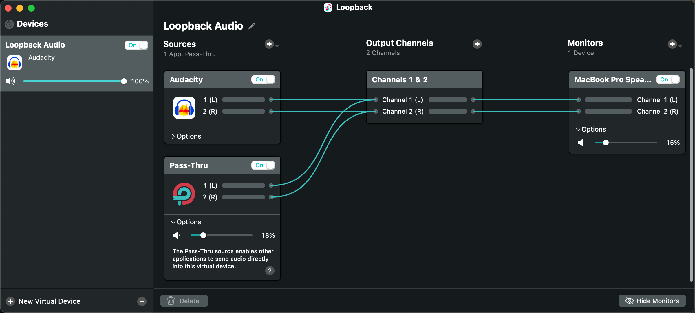

### iTerm2

系统自带的「Terminal」不见得特别好用，黑底白字让我梦回 cmd。当然，iTerm2 的开篇也是黑底白字，但是其中一些 feature 真是让人垂涎欲滴。

这是我的配置，大概长这个样子，比较大众化就是了。

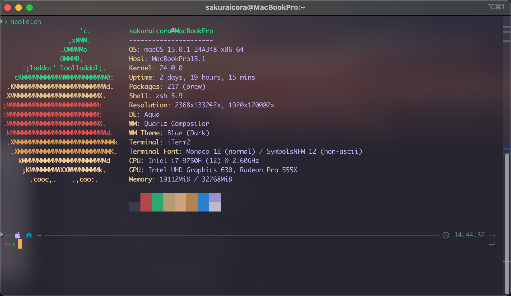

「command」+「，」-> Profiles -> 「+」-> Colors

配上喜欢的类 one-dark 主题，效果如下：

前往 repo -> [mbadolato/iTerm2-Color-Schemes/Duotone Dark](https://raw.githubusercontent.com/mbadolato/iTerm2-Color-Schemes/master/schemes/Duotone%20Dark.itermcolors)

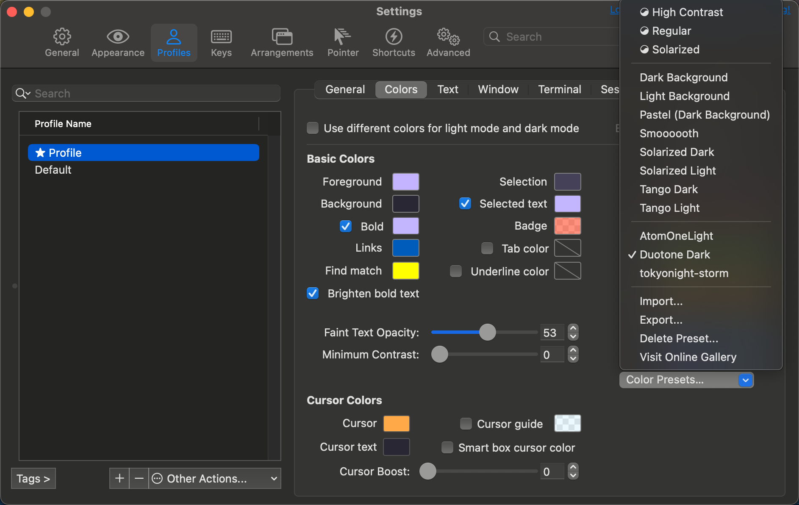

同时可以很方便地呼出终端，在 Keys -> Configure Hotkey Window 中，我这里是用的是双击「Option」键。

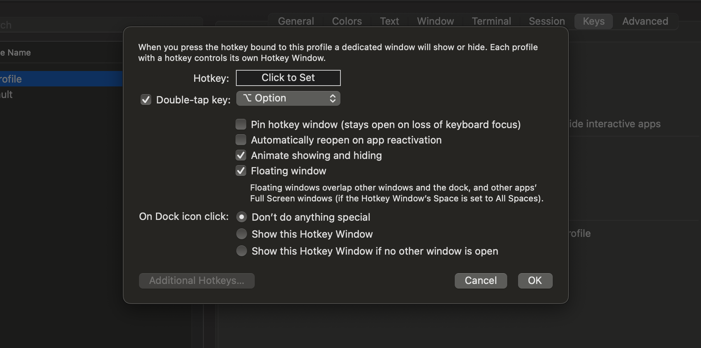

配置一手 oh-my-zsh，让终端用起来更加人性化。

```bash
sh -c "$(curl -fsSL https://raw.githubusercontent.com/ohmyzsh/ohmyzsh/master/tools/install.sh)"
```

美化方面的话，可以使用「p10k」这个主题，重要是这东西不仅好看，还好用。

前往 repo -> [romkatv/powerlevel10k](https://github.com/romkatv/powerlevel10k)

使用 Homebrew 安装

```bash
brew install powerlevel10k
echo "source $(brew --prefix)/share/powerlevel10k/powerlevel10k.zsh-theme" >>~/.zshrc
```

安装好后，使用如下命令开始配置。

```bash
p10k configure
```

按照提示，老老实实选择就行，然后就会得到一个简约且实用的 zsh。

最喜欢的一集，还可以比较美观地显示 conda 环境。

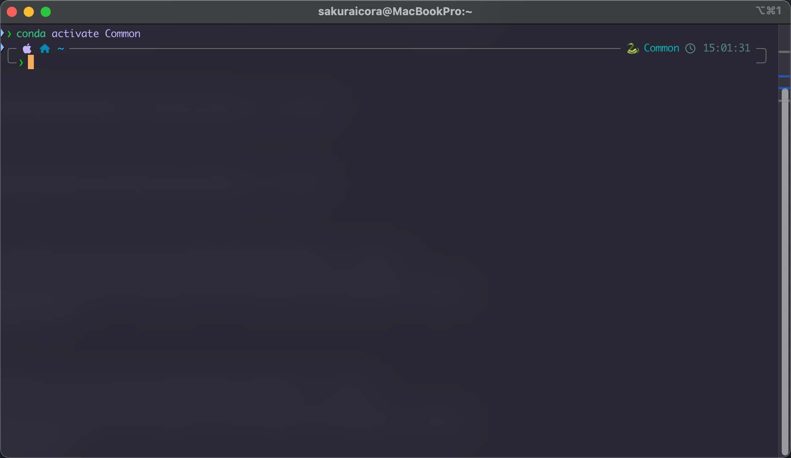

接下来就是配置一些实用的 zsh 插件。

```bash
brew install autojump zsh-autosuggestions zsh-syntax-highlighting
```

在 zshrc 中修改 plugin 设置。

```bash
plugins=(git autojump zsh-autosuggestions zsh-syntax-highlighting)
```

以历史命令补全为例，还是挺不错的。

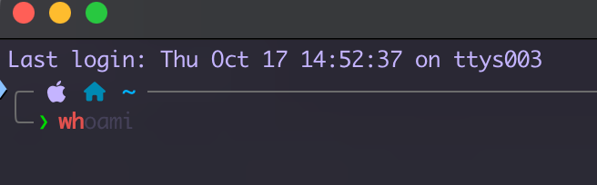


### Neovim & Visual Studo Code

之前用过 vsc 上的 vscode-vim 插件，本质上是一个 vim 模拟器，使用体验是适合初学者了解 vim，但是随之而来的就是卡卡卡卡卡卡卡顿。

所以这次我选择了使用 Neovim 作为核心，将 vsc 作为其前端。这样我既能使用 nvim 的快捷键，又能保留自己此前使用 vsc 的习惯，编码效率大大提升。

期间也尝试过 [Neovide](https://github.com/neovide/neovide)，非常好看，尤其是丝滑且炫酷的动画！但是 bug 太多，不适合严肃使用。

虽然可以将 vsc 作为 nvim 的前端，但是吧，也免不了有时候使用命令行快捷编辑文件，这里对三套配置（命令行、Neovide、vsc）做了一个侵入式的兼容，虽然不太优雅，但是能用。

通用型的配置强烈推荐 [LazyVim](https://www.lazyvim.org/)，非常好看，且好用。

先看看魔改之后命令行版本的效果，我觉得挺不错的^_^

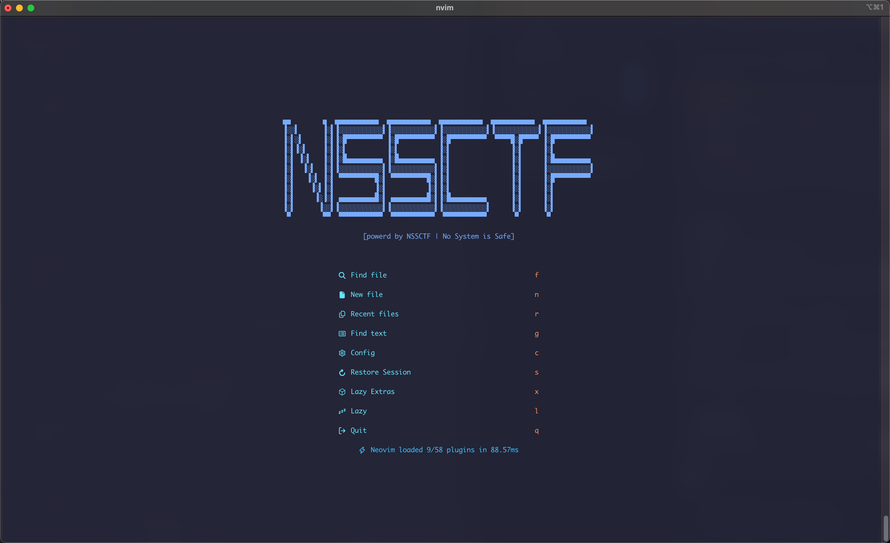

在备份好先前的配置文件后，开始安装 Lazyvim

```bash
git clone https://github.com/LazyVim/starter ~/.config/nvim
rm -rf ~/.config/nvim/.git
```

安装好后，进入终端，打开 nvim，Lazyvim 就会开始自动配置了。

开始魔改，我的需求是：

> 1. 兼容 Neovide，当 Neovide 启动时才执行配置
> 2. 兼容 vsc，当 vsc 启动时才执行配置
> 3. 兼容 命令行模式，当以命令行启动时才执行配置

于是我又了这样的配置目录：

``` bash
├── init.lua
├── lua
│   ├── config
│   │   ├── autocmds.lua
│   │   ├── keymaps.lua
│   │   ├── lazy.lua
│   │   └── options.lua
│   ├── plugins
│   │   ├── xxx.lua
│   │   └── xxx.lua
│   └── plugins-vscode
│       ├── xxx.lua
│       └── xxx.lua
└── ...
```

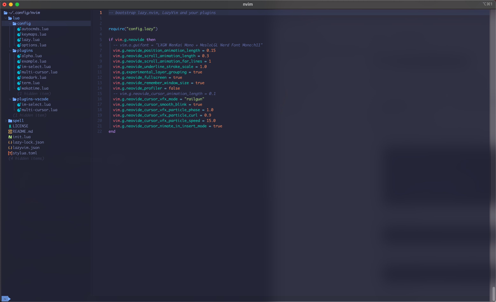

在「init.lua」中配置对 Neovide 的兼容配置项，具体可参考 [https://neovide.dev/configuration.html](https://neovide.dev/configuration.html)

```lua
-- bootstrap lazy.nvim, LazyVim and your plugins


require("config.lazy")

if vim.g.neovide then
  -- vim.o.guifont = "LXGW WenKai Mono + MesloLGL Nerd Font Mono:h11"
  vim.g.neovide_position_animation_length = 0.15
  vim.g.neovide_scroll_animation_length = 0.3
  vim.g.neovide_scroll_animation_far_lines = 1
  vim.g.neovide_underline_stroke_scale = 1.0
  vim.g.experimental_layer_grouping = true
  vim.g.neovide_fullscreen = true
  vim.g.neovide_remember_window_size = true
  vim.g.neovide_profiler = false
  -- vim.g.neovide_cursor_animation_length = 0.1
  vim.g.neovide_cursor_vfx_mode = "railgun"
  vim.g.neovide_cursor_smooth_blink = true
  vim.g.neovide_cursor_vfx_particle_phase = 1.0
  vim.g.neovide_cursor_vfx_particle_curl = 0.9
  vim.g.neovide_cursor_vfx_particle_speed = 15.0
  vim.g.neovide_cursor_nimate_in_insert_mode = true
end
```

在 config/*.lua 目录下是 Lazyvim 默认的配置项，当两边有不同的需求时，比如我需要在 nvim 中使用 dap 用于 debug，但是 vsc 中有好用的 debugger，则当我在使用 vsc 的时候就不需要加载 dap 这个插件了，同理，配置中有关 dap 的配置项也就无效了，甚至可能报错——毕竟我没有加载这个插件。

所以，这里也就是我所说的「不那么优雅的侵入式」魔改，但是你就说他能不能用吧？

我们需要为原来的 **每一个配置项** 添加一个选择分支语句，如下：

```lua
if vim.g.vscode then
    -- vscode 的配置项
else
    -- 原来的配置项
end
```

例如，当我们在 lua/config/lazy.lua 中添加如下这个分支语句：

```lua
if vim.g.vscode then
  require("lazy").setup({
    spec = {
      { "LazyVim/LazyVim", import = "lazyvim.plugins" },
      { import = "lazyvim.plugins.extras.vscode" },
      { import = "plugins-vscode" },
    },
  })

else
  -- 原来的配置项
end
```

然后我们就可以在 plugins-vscode 目录下添加 vsc 需要的插件了。

其实插件完全可以使用 vsc 的插件生态解决，这里推荐一款为 vscode-neovim 特化的多光标插件

创建并编辑以下文件 lua/plugins-vscode/nulti-cursor.lua，保存后重启 vscode，即可启用该插件。

```lua
return
{
    'vscode-neovim/vscode-multi-cursor.nvim',
    event = 'VeryLazy',
    cond = not not vim.g.vscode,
    opts = {},
}
```

添加多光标，效果如图所示

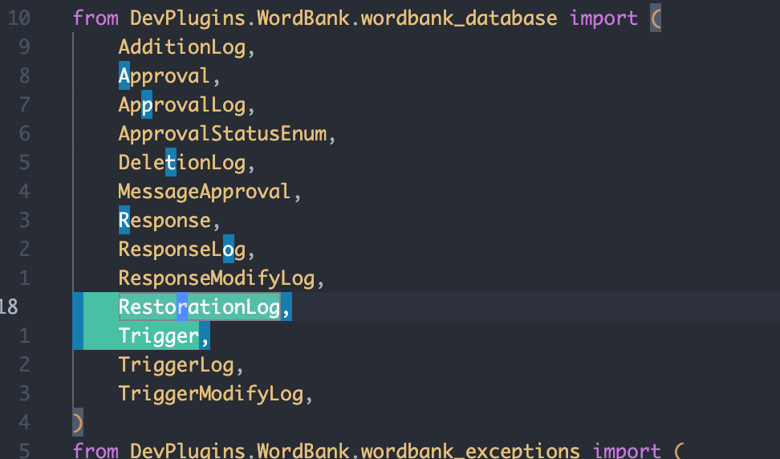

最后是还需要解决的问题：输入法。这是一个非常影响效率的问题，尤其是在需要中英文混合编辑的时候，可能出现以下情况：


以及「zf」、「zo」这一类的折叠快捷键无法正常使用，还需要研究研究（ーー；）

## 一些感受

续航没有传说中的那么强，毕竟不是 M 系列的芯片，干重活两个小时就举白旗了，稍微写一下代码、浏览网页的话，还是一个不错的选择，能勉强维持四个小时左右。

发热是不可避免的，没办法，尤其是 Touch Bar 那个地方，烫起来是真的没法摸。

拿到这台 MacBook Pro 的日期刚好是 2024.10.04，至于为什么是「刚好」，可能有一些其他原因在里面。当天正在寻找一些有意义的东西，转头一看，诶！这不是上个世纪的 Touch Bar 嘛！当天光速配好 Xcode，查了一堆资料，算是歪歪斜斜地把第一个 Touch Bar 程序写出来了，代码过于难看，就不放出来了，但是还是挺有意义的 ^_^

正巧也是省赛前半个月，极限换电脑导致我还是比较担心自己的环境是否齐全，嘛，慢慢整理就行了。

# 终

每一次写 blog 最大的阻碍不是新建文件夹，也不是选题选材，而是头顶上这个「cover」。说真的，找到能够描述写文时心境的插画还真不容易。有关本站引用的所有图片，均可以在 `/about` 路由中 **「Sources of images used in this site」** 板块找到。